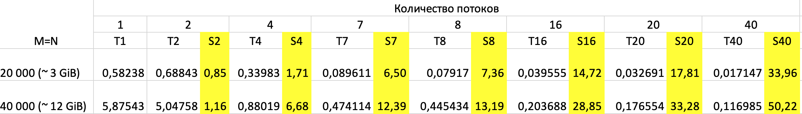
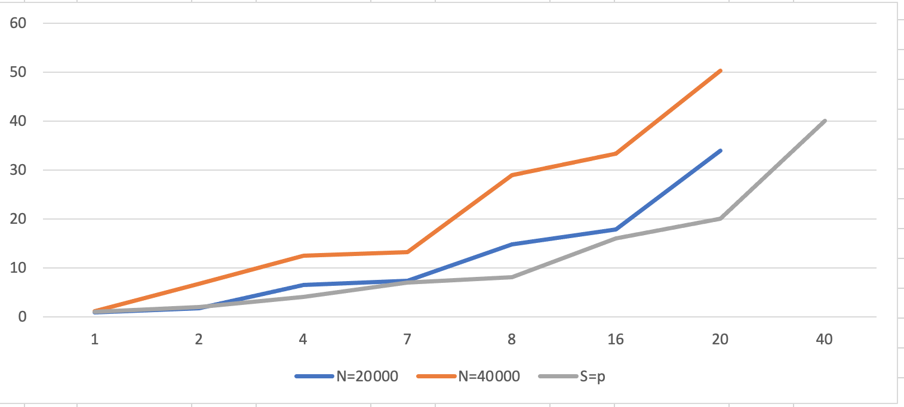

# Задание 1. Анализ масштабируемости OpenMP при умножении матрицы на вектор

## Описание вычислительного узла
Все измерения проводились на сервере со следующими характеристиками:

**Характеристики CPU**
```
Вычислительный узел:
CPU (lscpu)
Architecture:                x86_64
  CPU op-mode(s):            32-bit, 64-bit
  Address sizes:             46 bits physical, 48 bits virtual
  Byte Order:                Little Endian
CPU(s):                      80
  On-line CPU(s) list:       0-79
Vendor ID:                   GenuineIntel
  Model name:                Intel(R) Xeon(R) Gold 6248 CPU @ 2.50GHz
    CPU family:              6
    Model:                   85
    Thread(s) per core:      2
    Core(s) per socket:      20
    Socket(s):               2
    Stepping:                7
    CPU max MHz:             3900.0000
    CPU min MHz:             1000.0000
    BogoMIPS:                5000.00

NUMA node:
available: 2 nodes (0-1)
node 0 cpus: 0 1 2 3 4 5 6 7 8 9 10 11 12 13 14 15 16 17 18 19 40 41 42 43 44 45 46 47 48 49 50 51 52 53 54 55 56 57 58 59
node 0 size: 385636 MB
node 0 free: 306474 MB
node 1 cpus: 20 21 22 23 24 25 26 27 28 29 30 31 32 33 34 35 36 37 38 39 60 61 62 63 64 65 66 67 68 69 70 71 72 73 74 75 76 77 78 79
node 1 size: 387008 MB
node 1 free: 346595 MB
node distances:
node   0   1 
  0:  10  21 
  1:  21  10 

Операционная система: Ubuntu
**Наименование сервера** ProLiant XL270d Gen10:
```

### Задание 1. умножение матрицы на вектор 
## Цель задания

Реализовать многопоточную версию умножения матрицы на вектор с параллельной инициализацией массивов с помощью OpenMP.  
Провести анализ масштабируемости для размеров матриц **20 000 × 20 000** и **40 000 × 40 000** на разном количестве потоков (1, 2, 4, 7, 8, 16, 20, 40).


## Как собрать и запустить

### Сборка
```
cd task1
make          # или make clean && make
```

## Запуск
С привязкой к одной NUMA-ноде
```
OMP_NUM_THREADS=1  numactl -N 0 ./1 20000 1
OMP_NUM_THREADS=40 numactl -N 0 ./1 40000 40
```

Без привязки к ноде:
```
OMP_NUM_THREADS=40 ./1 40000 40
```

# Результаты (без привязки к NUMA-ноде)



# График



## Вывод о масштабируемости
При запуске без привязки к NUMA-ноде программа демонстрирует сверхлинейное ускорение (superlinear speedup).
На матрице 40 000 × 40 000 достигнуто ускорение 50.22 раза на 40 потоках, что значительно превышает линейное значение.
Такой результат объясняется эффективным распределением потоков по обеим NUMA-нодам сервера, что позволяет лучше использовать суммарный объём кэш-памяти и пропускную способность памяти.
При увеличении размера матрицы масштабируемость улучшается, так как растёт объём полезных вычислений относительно накладных расходов на синхронизацию и доступ к памяти.


### Компиляция
```
g++ -O3 -fopenmp -std=c++17 -march=native -Wall 1.cpp -o 1
```