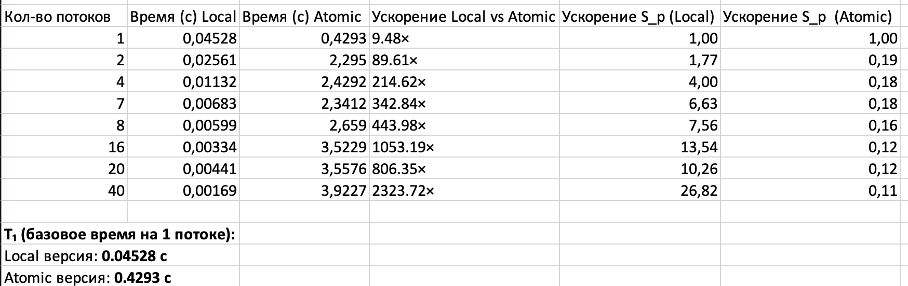
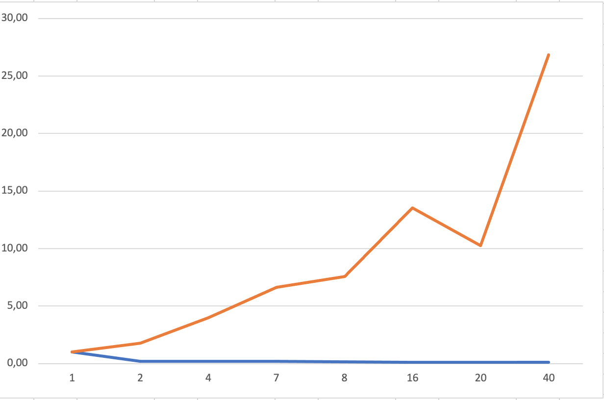

# Задание 2. Параллельное численное интегрирование с OpenMP

## Описание вычислительного узла
Все измерения проводились на сервере со следующими характеристиками:

**Характеристики CPU**
```
Вычислительный узел:
CPU (lscpu)
Architecture:                x86_64
  CPU op-mode(s):            32-bit, 64-bit
  Address sizes:             46 bits physical, 48 bits virtual
  Byte Order:                Little Endian
CPU(s):                      80
  On-line CPU(s) list:       0-79
Vendor ID:                   GenuineIntel
  Model name:                Intel(R) Xeon(R) Gold 6248 CPU @ 2.50GHz
    CPU family:              6
    Model:                   85
    Thread(s) per core:      2
    Core(s) per socket:      20
    Socket(s):               2
    Stepping:                7
    CPU max MHz:             3900.0000
    CPU min MHz:             1000.0000
    BogoMIPS:                5000.00

NUMA node:
available: 2 nodes (0-1)
node 0 cpus: 0 1 2 3 4 5 6 7 8 9 10 11 12 13 14 15 16 17 18 19 40 41 42 43 44 45 46 47 48 49 50 51 52 53 54 55 56 57 58 59
node 0 size: 385636 MB
node 0 free: 306474 MB
node 1 cpus: 20 21 22 23 24 25 26 27 28 29 30 31 32 33 34 35 36 37 38 39 60 61 62 63 64 65 66 67 68 69 70 71 72 73 74 75 76 77 78 79
node 1 size: 387008 MB
node 1 free: 346595 MB
node distances:
node   0   1 
  0:  10  21 
  1:  21  10 

Операционная система: Ubuntu
**Наименование сервера** ProLiant XL270d Gen10:
```

## Цель задания

Реализовать параллельную версию численного интегрирования (приближение числа π)  
с использованием двух подходов:
- `#pragma omp atomic`
- Локальная переменная + `critical`

Оценить ускорение на 1, 2, 4, 7, 8, 16, 20, 40 потоках при `nsteps = 40 000 000`.

## Как собрать и запустить

```
cd task2
make
```

## Запуск
Обычный запуск:
```
OMP_NUM_THREADS=1  ./2 1
OMP_NUM_THREADS=40 ./2 40
```

С привязкой к одной NUMA-ноде
```
OMP_NUM_THREADS=16 numactl -N 0 ./2 16
```

Без привязки:
```
OMP_NUM_THREADS=40 ./2 40
```

## Автоматический запуск всех экспериментов

```
# С привязкой к ноде 0
for t in 1 2 4 7 8 16 20 40; do
    echo "===== threads=$t (with numactl -N 0) ====="
    OMP_NUM_THREADS=$t numactl -N 0 ./2 $t
done

# Без привязки
for t in 1 2 4 7 8 16 20 40; do
    echo "===== threads=$t (WITHOUT numactl) ====="
    OMP_NUM_THREADS=$t ./2 $t
done
```

## Вывод

При сравнении двух реализаций численного интегрирования видно кардинальное различие в масштабируемости.
Версия с использованием #pragma omp atomic показывает сильную деградацию производительности при увеличении числа потоков из-за высокой конкуренции за общую переменную.
Версия с локальной переменной в каждом потоке демонстрирует хорошую масштабируемость, достигнув ускорения 26.82 раза на 40 потоках.
Локальная версия превосходит atomic-версию в 2323 раза при запуске на 40 потоках, что подчёркивает важность избегания атомарных операций при суммировании больших объёмов данных.




